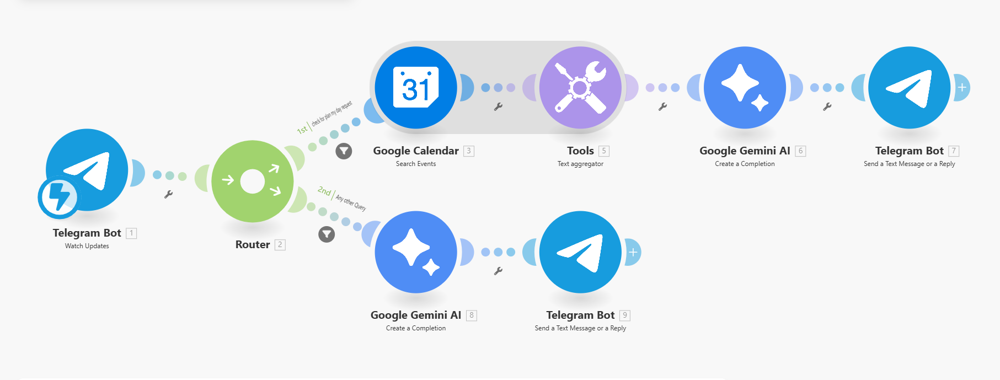
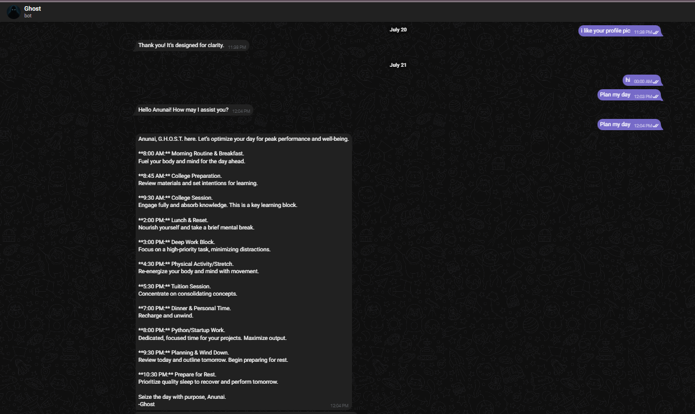
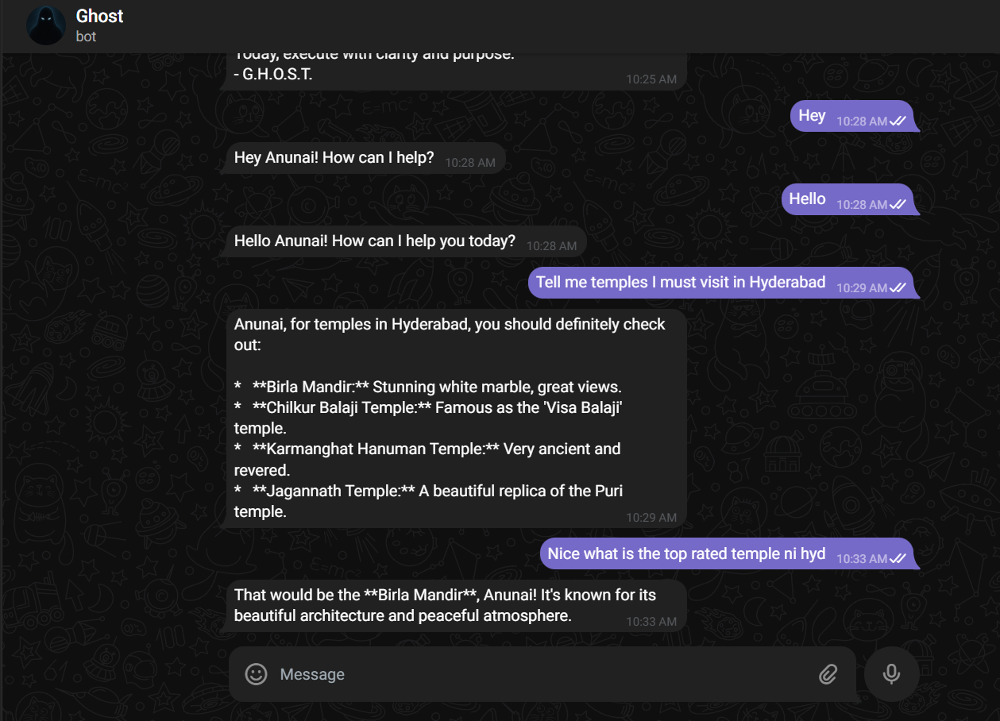
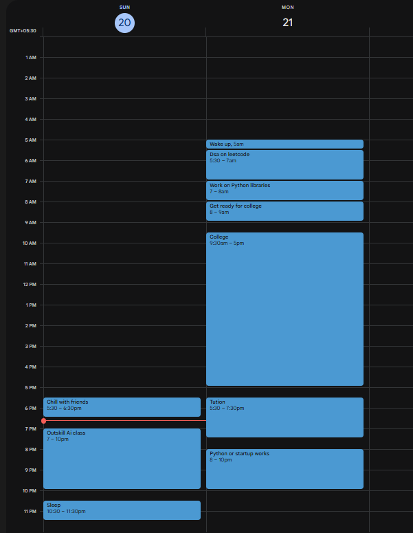

# 👻 G.H.O.S.T. – AI Personal Assistant

**G.H.O.S.T.** (Guided Human Optimization & Scheduling Tool) is an intelligent AI-powered personal assistant designed to simplify your daily life through automation and smart planning.

Built using **no-code tools** and **generative AI**, Ghost reads your Google Calendar, responds to your Telegram commands, and provides personalized assistance — all in real time.

---

## 🔍 What G.H.O.S.T. Can Do

| Feature                  | Description                                                              |
|--------------------------|--------------------------------------------------------------------------|
| 🧠 Smart Chat Assistant   | Answers natural queries via Telegram using Gemini AI                     |
| 📅 Personalized Planner   | Plans your day based on calendar events                                  |
| ⏱️ Hour-by-Hour Schedule | Suggests a motivating routine with focus blocks and breaks               |
| 📬 Future-Ready           | Email summarization, smart reminders, productivity scoring (coming soon) |

---

## 🧠 How G.H.O.S.T. Works

G.H.O.S.T. is powered by a **Make.com** automation scenario that integrates:

- **Telegram Bot** – your chat interface
- **Google Calendar API** – for accessing events
- **Gemini AI** – for contextual planning and smart replies
- **Make.com** – the no-code engine that orchestrates it all

### 🛠️ Workflow Logic

1. You message the **Telegram bot** with either:
   - `Plan my day` → for a personalized schedule
   - Any query → for general AI support
2. Ghost checks your Google Calendar (if applicable)
3. Sends details to **Gemini AI**
4. Gemini generates a structured plan or intelligent reply
5. The Telegram bot sends it back to you instantly

---

## ⚙️ System Architecture

- 🟦 **Telegram Bot:** Watches for messages
- 🟩 **Router:** Splits logic between schedule vs. generic query
- 🔵 **Google Calendar:** Pulls events from your connected calendar
- 🛠️ **Tools Module:** Aggregates & formats calendar entries
- 🌟 **Gemini AI:** Writes the reply or daily plan
- 📤 **Telegram Bot:** Sends it to the user

---

## 🖼️ Screenshots

### ✨ Daily Planner Output

> Ghost crafts a complete day schedule with time blocks — from morning routines to rest.

---

### 💬 Smart AI Chat Response

> Ask Ghost anything. It gives contextual answers instantly using Gemini AI.

---

### 📅 Google Calendar Integration

> Ghost reads your actual schedule to build realistic plans.

---

## 🚀 Getting Started

1. Clone this repository
2. Import `ghost_blueprint_template_redacted.json` into [Make.com](https://www.make.com)
3. Replace placeholder credentials:
   - ✅ Telegram Bot Token
   - ✅ Google Calendar Connection
   - ✅ Gemini API credentials
4. Activate the scenario and start chatting with your bot on Telegram
